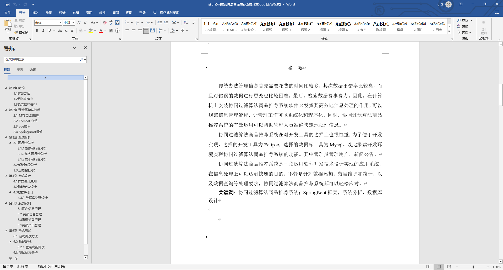
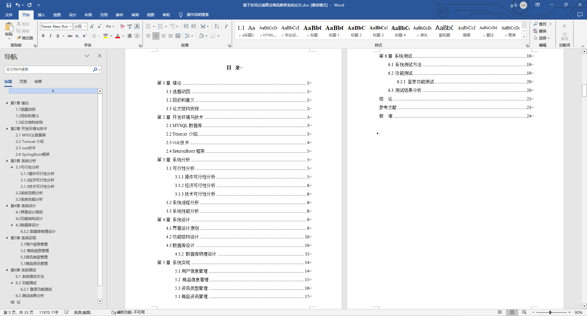
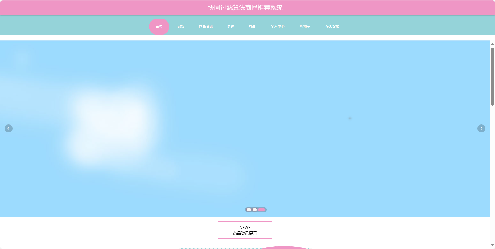
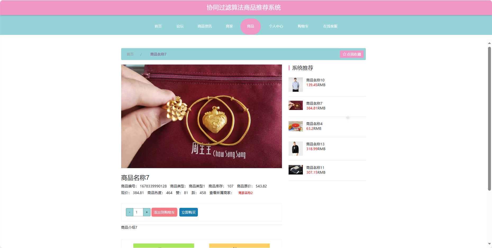
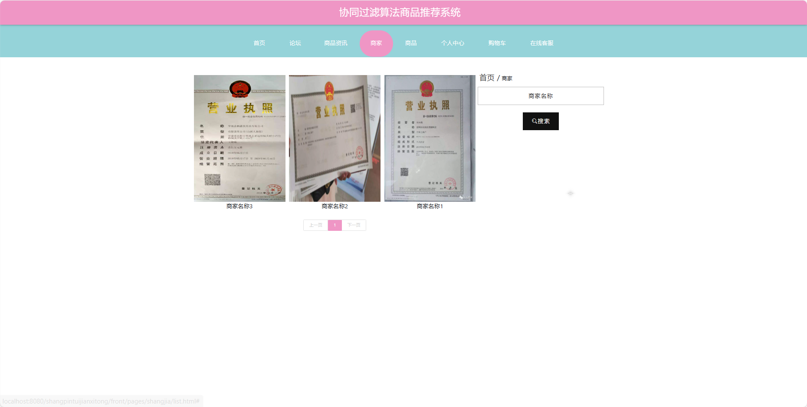
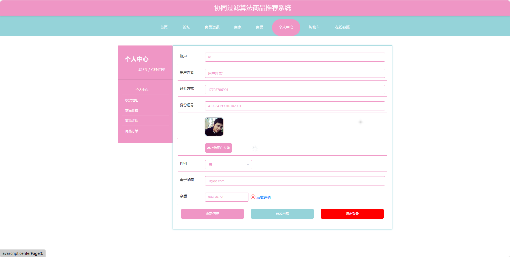

基于Springboot的商品推荐系统（程序+论文）
=
### 完整代码获取地址：从戎源码网 ([https://armycodes.com/](https://armycodes.com/))
### 作者微信：19941326836  QQ：952045282 
### 承接计算机毕业设计、Java毕业设计、Python毕业设计、深度学习、机器学习
### 选题+开题报告+任务书+程序定制+安装调试+论文+答辩ppt 一条龙服务
### 所有选题地址https://github.com/nature924/allProject

一、项目介绍
---
基于Spring Boot框架实现的协同过滤算法商品推荐系统，系统包含三种角色：管理员、用户,商家主要功能如下。

### 【用户功能】

1. **首页：** 浏览协同过滤算法商品推荐系统的主要信息和最新商品推荐。
2. **论坛：** 参与用户间的商品讨论和交流。
3. **商品资讯：** 阅读系统发布的关于商品的资讯。
4. **商家：** 浏览和搜索各个商家提供的商品信息。
5. **商品：** 浏览系统中各类商品，包括详细的商品信息和评价。
6. **个人中心：** 管理个人信息，查看购物车中的商品，进行下单等操作。
7. **购物车：** 查看已选购的商品，进行结算和下单。
8. **在线客服：** 与客服进行实时在线沟通。

### 【管理员功能】

1. **首页：** 查看协同过滤算法商品推荐系统。
2. **个人中心：** 修改密码、管理个人信息。
3. **管理员管理：** 审核和管理注册管理员用户的信息。
4. **用户管理：** 审核和管理注册用户的信息。
5. **商家管理：** 审核和管理注册商家的信息。
6. **商品管理：** 管理商品的信息，包括商品基本信息、评价、收藏和订单等。
7. **客服聊天管理：** 管理用户与客服之间的在线聊天记录。
8. **基础数据管理：** 管理系统的基础数据，包括资讯类型、商家类型和商品类型等。
9. **论坛管理：** 管理用户间的讨论和交流。
10. **商品资讯管理：** 发布、编辑和删除关于商品的资讯。
11. **轮播图信息：** 管理系统首页的轮播图。

### 【商家功能】

1. **首页：** 查看协同过滤算法商品推荐系统。
2. **个人中心：** 修改密码、管理个人信息。
3. **商品管理：** 管理商家提供的商品信息，包括商品基本信息、评价、订单等。
4. **论坛管理：** 管理用户间的讨论和交流，回复用户问题和关注。
5. **商品资讯管理：** 发布、编辑和删除关于商家商品的资讯。

二、项目技术
---
- 编程语言：Java
- 数据库：MySQL
- 项目管理工具：Maven
- 前端技术：VUE、HTML、Jquery、Bootstrap
- 后端技术：Spring、SpringMVC、MyBatis

三、运行环境
---
- 操作系统：Windows、macOS都可以
- JDK版本：JDK1.8以上都可以
- 开发工具：IDEA、Ecplise、Myecplise都可以
- 数据库: MySQL5.7以上都可以
- Tomcat：任意版本都可以
- Maven：任意版本都可以

四、运行截图
---
### 论文截图：

### 程序截图：

